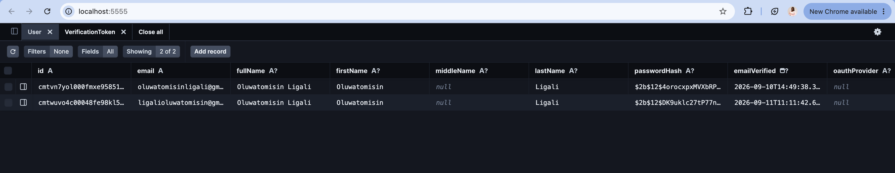
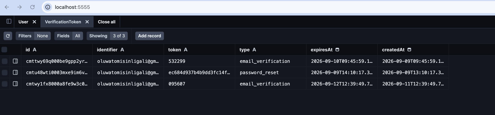
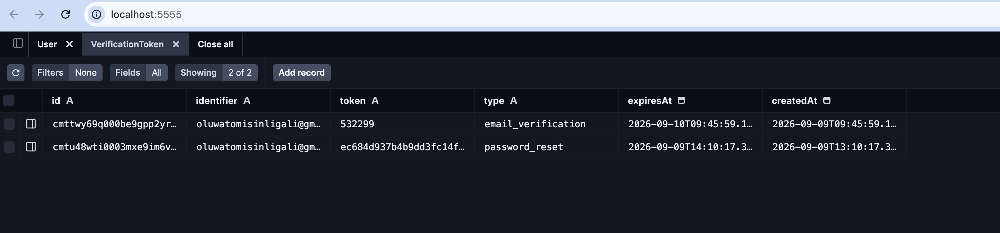

# Freelancer Hub — Authentication Slice Documentation

## Section 1: What This Is

This slice is the complete sign-in, sign-up, and account-security layer — everything before a user reaches the dashboard. A visitor can create an account (full name, email, password), prove email ownership with a six-digit code sent by mail, sign in, reset a forgotten password through a single-use link that expires within an hour, or sign in with Google. Every entry point is validated twice (in the browser for instant feedback, on the server as source of truth), and each is hardened: failed authentication causes escalating lockouts, a double-submitted sign-up cannot create two accounts, and the resulting session is a script-unreadable signed cookie whose anti-forgery token rotates before and after every login. Signed-in users land on a guarded dashboard ("You Are Signed In — Welcome, name") that no unauthenticated request can reach — the end of this slice.

Deliberately not included: the paying work itself (no clients, projects, invoices, or time-tracking — and the data model has no tables for them), profile/account management beyond the essentials (no email change, avatar, or 2FA yet), production-grade email infrastructure (mail goes to a working SMTP sender with no retry queue or delivery analytics), and deployment, monitoring, or billing. This scope discipline keeps the trust boundary small enough to reason about and verify end to end — the one guarantee this slice makes is that the person using the app is exactly who the app thinks they are, and that an honest mistake (double submit, slow capslock, forgotten password) can never cost them the account.

## Section 2: How To Run It

> A reviewer who can't run the project in under ten minutes assumes it doesn't run — so treat this checklist literally.

**Step 1 — Install prerequisites**
- **Node.js 20 or newer** (this project currently runs on Node 26; anything ≥20.9 works).
- **PostgreSQL** running locally (any modern version; the connection string in the next steps points at `localhost:5432`).
- **npm** (ships with Node).

**Step 2 — Get the code and install packages**
1. Clone the repository.
2. In the project root run: `npm install`

**Step 3 — Configure environment variables**
Copy the template to a private file (the template lives at the repo root, committed; real values must never be committed — `.env*` is git-ignored):
```
cp .env.example .env
```
Then fill in each value. The variables, by name, and where each one comes from:

| Variable | What it is / where it comes from |
|---|---|
| `DATABASE_URL` | Postgres connection string. Comes from your own local database setup (`user:password@host:port/dbname`). |
| `NEXTAUTH_SECRET` | Random secret for signing sessions and tokens. Generate one yourself, e.g. `openssl rand -base64 32`. Never share it. |
| `NEXTAUTH_URL` | Public URL of the app during dev — `http://localhost:3000`. |
| `APP_URL` | Optional. Base URL used to build email links (verification/reset). Defaults to `NEXTAUTH_URL`. |
| `SMTP_HOST`, `SMTP_PORT`, `SMTP_SECURE`, `SMTP_USER`, `SMTP_PASS` | Email sending. The template is pre-filled for Gmail: create a Gmail **App Password** (Google Account → Security → 2-Step Verification → App passwords) and use it as `SMTP_PASS`. Other providers: change host/port/secure. |
| `MAIL_FROM` | The "From" line on outgoing email, e.g. `Freelancer Hub <you@gmail.com>`. |

**Step 4 — Set up the database (migrations)**
The schema (including the unique-email index, login-attempt lockout table, and signup idempotency table) is defined in `prisma/schema.prisma` with four committed migrations. Apply them to your database with:
```
npm run db:migrate
```
This runs `prisma migrate dev` — applies pending migrations to `DATABASE_URL` and regenerates the Prisma client. (For a scripted/deploy run use `npm run db:deploy` instead.)

**Step 5 — Start the app**
```
npm run dev
```

**Step 6 — Open it**
Point your browser at **http://localhost:3000**. You land on the sign-up screen (`/auth`); a fresh install ships with zero users, so the flow you'll see is: create an account → enter the email code → sign in → dashboard.

**Step 7 — Send real email (if you want to verify codes)**
Any valid SMTP settings from Step 3 will do. In dev, the verification / reset emails are sent through those credentials, so check the inbox (or spam) of the address you set as `SMTP_USER` — or use a throwaway address you control.

Notes: `.env.example` already exists in the repo with commented placeholders (real keys never committed; `.env` is git-ignored). It covers every variable needed to run the app.

## Section 3: The Flow, Step By Step

This is the journey a person takes from arriving to logged-out to sitting on the dashboard — the happy path (create account → verify → sign in → dashboard), plus the two detours (forgot/reset password, and re-sending a code). Follow along in the code; each step names its home.

**A note on where it all lives:** the whole screen is one page, `src/app/(auth)/auth/page.tsx`, which swaps between five views (`signin`, `signup`, `forgot`, `reset`, `verify`) — a selector made of a `view` query parameter and React state. All account mutations run through plain HTTP endpoints under `/api/auth/*` (`src/app/api/auth/signup | verify | resend | forgot | reset | csrf-rotate/route.ts`), whose brains live in one shared module, `src/server/services/auth-flows.ts`; the rules live in `src/lib/validation/auth.ts`, password work in `bcrypt`, and session logic in `src/lib/auth/auth.ts`. The routes accept JSON only (`Content-Type: application/json` is enforced), which is itself the CSRF control for this API layer — a cross-site `<form>` cannot send a JSON payload without CORS preflight permission, which is never granted. The account flows were moved from Next.js server actions to these route handlers so they behave identically under a production `next start` build and the browser, and so the endpoints can be exercised directly (as Proof 1 does below).

**Step 1 — Arrival**
- **User:** visits the app. Any path, `/` included, eventually lands on `/auth` (the root redirects here).
- **Frontend:** loads `page.tsx`; with no query it defaults to the **signup** view, so the first thing anyone meets is "Create Your Account".
- **Server:** renders the page. Nothing sensitive happens yet; this is purely a form.

**Step 2 — Create account**
- **User:** types full name, email, and password. Note `src/components/ui/Input.tsx` — every field has a label physically bound to it and a live error message beneath it.
- **Frontend:** with every keystroke, `handleFieldChange` runs the *client* copy of the rules (`clientValidation` in `validation/auth.ts`) and shows/reveals errors instantly. There's no typing when the email is misformatted or the password is weak. On submit it POSTs a JSON body with the trimmed fields **plus an idempotency key** (a UUID it keeps in `sessionStorage`, key `fh:signup:idempotencyKey`) to `/api/auth/signup` through a small `postJson` helper in `page.tsx`.
- **Server** (`handleSignup` in `src/server/services/auth-flows.ts`): re-validates everything with `signupSchema` and the idempotency key format — the client can be tricked, the server can't. It checks the lockout table for this email+IP. It looks up whether this key already created an account: if yes (COMPLETED) it replays the same success; if another copy of this submit is still running (PENDING) it says "already being processed". Then it does the expensive work — `bcrypt.hash(password, 12)` — and in one database transaction creates the user, a 6-digit verification code (with a 24-hour expiry) and a row marking this key as used. If a duplicate email slips in, the static unique constraint trips `P2002` and the server reports "account already exists" and records a failed attempt. Success → `enqueueVerificationEmail` hands the code to the mailer (`src/lib/background/email-jobs.ts` → `src/lib/mail.ts`), and the failures counter is cleared.

**Step 3 — Verify email**
- **User:** checks their inbox, types the 6-digit code from the email into the verify view.
- **Frontend:** POSTs `{ code }` to `/api/auth/verify`. If the code never arrives, "Resend code" POSTs `{ email }` to `/api/auth/resend`.
- **Server** (`handleVerifyEmail` / `handleResendVerification` in `auth-flows.ts`): looks the code up in the database, checks it really is an email-verification code, and compares the **stored** `expiresAt` against now — the expiry lives in the DB, not the browser. It marks `emailVerified` and deletes the code, so a code works exactly once. Meanwhile the resend handler enforces the 60-second cooldown from the stored timestamp of the last code, then replaces all old codes with a fresh one (also 24h) and emails it.
- **Frontend:** on success the view switches to sign-in.

**Step 4 — Sign in**
- **User:** types email and password. (Button stays disabled until the fields pass the same client rules.)
- **Frontend:** first POSTs to `/api/auth/csrf-rotate` so this attempt uses a brand-new anti-forgery token, then hands over to `next-auth/react`'s `signIn("credentials", …)`, which POSTs the credentials to `/api/auth/callback/credentials`.
- **Server** (`src/lib/auth/auth.ts`, the `authorize` function): parses credentials through `loginSchema` (the same rules as the client), enforces the progressive lockout (`src/lib/auth/rate-limit.ts` — 3 failures → 2 minutes, doubling up to 24h), looks up the user, and walks the guardrails in order: no such user → record failure; account deactivated → refuse; email unverified → tell them; wrong password → record failure. Only a bcrypt-verified password clears the counter and returns a user.
- **Server (session):** Auth.js signs a JWT and sets the `authjs.session-token` cookie (30 days, `httpOnly`, `sameSite: "lax"`). The frontend then finishes with a second POST to `/api/auth/csrf-rotate`, so the session is never tied to the pre-login token, and navigates to the `callbackUrl`.

**Step 5 — The guarded dashboard**
- **User:** (passively) is on `/dashboard`.
- **Frontend:** requests any `/dashboard/*` path.
- **Server:** `proxy.ts` runs on every dashboard route and, without a session, redirects to `/auth?callbackUrl=…`. Even if that's bypassed, `src/app/(dashboard)/layout.tsx` re-checks `auth()` server-side before rendering anything. With a session, only then does the user see "You Are Signed In — Welcome, name".

**Step 6 — Forgot password**
- **User:** from sign-in clicks "Forgot password" and enters the account email.
- **Frontend:** validates the email and POSTs `{ email }` to `/api/auth/forgot`.
- **Server** (`handleForgotPassword` in `auth-flows.ts`): validates, checks lockout, and — to avoid confirming which emails exist — answers "if that email is in our system, you'll get a link" whether or not the user exists. For a real user it deletes any prior reset tokens, creates a fresh 32-byte random token with a **1-hour** expiry (type `password_reset`), clears failures, and emails a link built as `${APP_URL}/auth?view=reset&token=…` (`mail.ts:104`).

**Step 7 — Reset password**
- **User:** clicks the link (lands on `/auth?view=reset&token=…`; the token is read at `page.tsx:830`) and types a new password twice.
- **Frontend:** validates like every other field, then POSTs `{ token, password, confirmPassword }` to `/api/auth/reset`.
- **Server** (`handleResetPassword` in `auth-flows.ts`): re-validates, finds the token, confirms it's a reset token, checks its DB expiry (expired → deleted), hashes the new password with bcrypt 12, updates the user, and **deletes the token** — single use, so the same link can never be reused.

**Step 8 — Sign out**
- **User:** clicks "Sign Out" (`src/components/dashboard/SignOutButton.tsx`).
- **Frontend:** calls `signOut({ callbackUrl: "/auth" })` from `next-auth/react`, which POSTs to Auth.js's own `/api/auth/signout` route handler.
- **Server:** the route clears the session cookie and returns everyone to `/auth`. Logout always runs server-side — never just a client-side disappearing act.

By the end, the reader should be able to name the file for any behaviour: forms → `page.tsx`, business rules → `validation/auth.ts` + `server/services/auth-flows.ts` (exposed at `/api/auth/*`), the sign-in gatekeeping → `auth.ts`, the door → `proxy.ts` + the dashboard layout, and the two detours → `handleForgotPassword` + `handleResetPassword` (both in `auth-flows.ts`).

## Section 4: The Data Model

The authentication slice owns exactly four tables: **User**, **VerificationToken**, **AccountRequest**, and **LoginAttempt**. No other tables exist in this repository.

### `User` — one row per person who can sign in

```prisma
model User {
  id            String    @id @default(cuid())
  email         String    @unique
  fullName      String?
  firstName     String?
  middleName    String?
  lastName      String?
  passwordHash  String?
  emailVerified DateTime?
  oauthProvider String?
  oauthId       String?
  deactivatedAt DateTime?
  createdAt     DateTime  @default(now())
  updatedAt     DateTime  @updatedAt

  @@index([email])
}
```

Column decisions:
- **`id`**: `cuid()` over an auto-incrementing integer — non-sequential, so user ids can't be guessed/enumerated from the outside.
- **`email` `@unique`**: the login identity. Unique means the database itself refuses two accounts with the same address — the primary anti-duplicate defence (see the answer at the end). `@@index([email])` exists because lookups-by-email (login, forgot-password, resend) are the hottest queries; the unique index also accelerates exact matches.
- **`fullName` / `firstName` / `middleName` / `lastName`**: `fullName` is what the user typed ("Jane Z Doe"); the three parts are split out (`middleName` joins extras beyond three words). All nullable because a Google-only sign-in creates a user with no typed name at all.
- **`passwordHash` nullable**: a deliberate decision — a Google-created account has no password, so rather than a fake hash the column is simply null and login-by-password is impossible for those rows.
- **`emailVerified` nullable**: null until the email code is confirmed; it doubles as the gate — sign-in is refused while it's null, so the account can't be used before ownership is proven.
- **`oauthProvider` / `oauthId`**: nullable; set only for the Google path, kept so a Google user can be matched back on future logins without creating a second row.
- **`deactivatedAt` nullable**: the deactivation switch. Null = active; set = "grace period started", and sign-in is blocked while set.

### `VerificationToken` — one row per outstanding email code or reset link

```prisma
model VerificationToken {
  id         String   @id @default(cuid())
  identifier String
  token      String   @unique
  type       String
  expiresAt  DateTime
  createdAt  DateTime @default(now())

  @@index([identifier, type])
}
```

- **`identifier`**: the email address. Deliberately a **string, not a foreign key** to `User` — the code row only needs to *name* its owner, and this keeps token creation independent of whether the user row was created first (signup) or already existed (forgot-password).
- **`token` `@unique`**: the 6-digit verification code or the 32-byte reset secret. Unique means a lookup by token is never ambiguous and two rows can never collide on the same secret.
- **`type`**: plain string (`"email_verification"` or `"password_reset"`), one table serving both kinds. **Note:** the allowed values are *not* enforced by the database — the app checks and rejects mismatched types. The expiry rule below, however, *is* a data decision, not a UI one.

### `AccountRequest` — the idempotency ledger

```prisma
model AccountRequest {
  id             String    @id @default(cuid())
  idempotencyKey String    @unique
  email          String
  status         String    @default("PENDING")
  createdAt      DateTime  @default(now())
  completedAt    DateTime?

  @@index([email])
}
```

- **`idempotencyKey` `@unique`**: the whole point of the table. Each sign-up submit arrives with a one-time key; the unique index means only *one* row per key can ever exist. Two `INSERT`s racing with the same key → one wins, the other trips `P2002` and mirrors the winner's outcome. This is the constraint that makes double submission a single account.
- **`email`**: the address the key created. Not unique — many keys may target the same email; the `User.email` unique index is what stops duplicates there.
- **`status`**: `"PENDING"` → `"COMPLETED"` (values again enforced by application code). A replayed FUTURE key'd request after completion replays the success message; a `PENDING` row means the original submit is still in flight.
- **`completedAt` nullable**: null while pending; stamped the moment the user account exists, so "this key already did its job" can be told apart from "still running".

### `LoginAttempt` — the lockout counter

```prisma
model LoginAttempt {
  id          String    @id @default(cuid())
  email       String
  ip          String
  failures    Int       @default(0)
  lockedUntil DateTime?
  lastAttempt DateTime  @default(now())
  createdAt   DateTime  @default(now())
  updatedAt   DateTime  @updatedAt

  @@unique([email, ip])
  @@index([email])
  @@index([ip])
}
```

- **`email` / `ip`** (both non-null): the pair that is being rate-limited. `ip` lets an attacker's repeated failures on *any* account be throttled; `email` stops a brute-force across many IPs.
- **`@@unique([email, ip])`**: one counter row per pair. Two simultaneous failed logins can't fork into two half-counters — whoever inserts first owns the pair; the rest update it.
- **`failures`**: how many consecutive failures so far; the lockout schedule derives from it (3 → 2 min, doubling to 24h).
- **`lockedUntil` nullable**: null = not locked; set = locked until a timestamp. This *is* the expiry of a lockout, stored in the DB so a redeployed/restarted app can't forget who's locked.

### Which constraints make an invalid state impossible?

These are the concrete "last line of defence" rules, each preventing a state that app bugs could otherwise produce:

1. **`User.email` unique (unique index)** → it is **impossible to have two accounts with the same email**, no matter how badly the sign-up code races. This is also the exact error (`P2002`) the idempotency handler leans on.
2. **`VerificationToken.token` unique** → it is **impossible for two codes/links to be the same string**, so a look-up by token always resolves to exactly one intent.
3. **`LoginAttempt` `@@unique([email, ip])`** → it is **impossible to have two divergent lockout counters for the same email+IP**, which keeps the lockout escalation coherent under concurrent failures.
4. **`AccountRequest.idempotencyKey` unique** → it is **impossible for two sign-up requests to claim the same idempotency key**, which is the database backstop for the double-submit safe sign-up handler.

**Honest caveat — what the schema does *not* enforce:** `status` and `type` string values, email shape, "failures can't be negative", and the 6-digit-ness of a code are all application-level (Zod + action code), not database CHECK constraints. The schema has no `CHECK`s and no enum columns. The four uniqueness rules above are the only database-enforced invariants — chosen because they're the ones where a bug could otherwise corrupt identity or duplicate an account, and where an error message from the DB is still a correct, safe outcome.

## Section 5: The Concepts

These eight concepts are exactly the eight the brief asks for, each one mapped to a real line of code that exists in this repository: password hashing, rate limiting, client-side versus server-side validation, session management and why I chose sessions, token and code expiry and why it must live in the database, idempotency, database constraints as a last line of defence, and protected routes.

### 1. Password Hashing

**What it is.** Hashing scrambles a password into a fixed-length string that cannot be turned back into the original. When you sign in, the app hashes what you typed and compares it with the stored hash. The real password is never stored anywhere, so the system can't lose it even if the database leaks.

**Why it is needed.** If someone obtains a copy of the database, plain passwords hand them every account instantly — and because people reuse passwords, those same credentials would open accounts on other sites too. Without hashing, a single leak is a total compromise. Even with hashing, a stolen database only gives up slowly-worked strings, buying time and making mass recovery costlier than it's worth.

**How I implemented it.** bcrypt with cost factor 12, using the pure-JavaScript `bcryptjs` package. The hash is created at signup and again on password reset (`handleSignup` / `handleResetPassword` in `src/server/services/auth-flows.ts`):
```ts
const passwordHash = await bcrypt.hash(password, 12);
```
and compared at sign-in (`src/lib/auth/auth.ts:89`):
```ts
const isValid = await bcrypt.compare(password, user.passwordHash);
if (!isValid) { await recordLoginFailure(email, ip); throw new InvalidCredentialsError(); }
```
Cost 12 means each hash takes roughly 300–500ms — trivial for one honest login, crippling for someone testing millions.

**What I chose against, and why.** SHA-256 is a general-purpose hash: fast, which is precisely why it's wrong for passwords — an attacker can test billions a second. Argon2 is arguably stronger (memory-hard, resists GPU farms), but bcrypt is well understood, well supported everywhere, and I could reason about its behavior in this stack. Separately, I chose `bcryptjs` over the native `bcrypt` build specifically to avoid native-compile issues across environments; the small speed cost is irrelevant at cost 12.

### 2. Rate Limiting with Progressive Lockout

**What it is.** After a few failed attempts, the pair "email + IP address" is locked out for a time that grows with each further failure — starting at 2 minutes, doubling, capped at 24 hours — tracked in the database.

**Why it is needed.** Without it, someone can fire thousands of login attempts a minute at accounts (or the whole app) until a password is guessed or until the database is hammered into submission. A flat "5 failures, ever" is also wrong: an attacker just waits out a fixed timer. Escalating, per-pair lockouts make guessing a losing arithmetic game while honest users are rarely touched.

**How I implemented it.** A `LoginAttempt` table, unique per `(email, ip)` (`src/lib/auth/rate-limit.ts`):
```ts
export function lockoutDurationMinutes(failures: number): number {
  if (failures < 3) return 0;
  if (failures >= 23) return 24 * 60;
  return Math.min(2 * 2 ** (failures - 3), 24 * 60);
}
```
`enforceLoginRateLimit`/`recordLoginFailure` are called from all entry points — login in `auth.ts`, and a shared set of handlers in `auth-flows.ts` for signup, forgot-password, and resend-verification; every failure increments the count, a successful login calls `clearLoginFailures`.

**What I chose against, and why.** An in-memory counter per IP was my first cut (`src/lib/security/rate-limit.ts`), abandoned and removed from the repository in review — it resets on every restart and can't see the email behind a shared IP. I also ruled out a fixed window per IP alone, because a rotating attacker slips through and a whole office behind one IP gets locked out collectively. The `(email, ip)` pair, stored and escalating, was the deliberate middle ground.

### 3. Server-side Validation as Schemas, Mirrored on the Client

**What it is.** Every input rule (email shape, password length and character classes, name rules) is written once, as a Zod schema — a declarative "rule sheet" — and both the browser and the server draw from that same sheet.

**Why it is needed.** If rules are hand-written inside each handler, they drift: signup checks one thing, login checks another, and the client shows different errors than the server produces. Worse, client-only validation is theater — anyone can call the server without the page. A single schema means the one source of truth describes both the nice-to-have feedback and the must-have gate.

**How I implemented it.** All rules live in `src/lib/validation/auth.ts`:
```ts
const passwordSchema = z.string().trim().min(1, "Password is required.")
  .min(8, "Password must be at least 8 characters long.")
  .max(64, "Password must be at most 64 characters long.")
  .superRefine((value, ctx) => { /* lowercase, uppercase, digit, special */ });
```
The server handlers call `validateSignupInput`, `loginSchema.safeParse` (inside `authorize`, `auth.ts:68`), `validateForgotPasswordInput`, `validateResetPasswordInput`. On the client, the same sheets are exported as `clientValidation` and run on every keystroke in `page.tsx` (`handleFieldChange`), so the errors that appear while typing are exactly the errors the server would produce.

**What I chose against, and why.** Scattered `if/else` checks inside each handler (drift and repetition), and HTML5-only validation with no server counterpart (the browser can be ignored). I also chose to derive the shared Zod schemas rather than keep two separate rule sets — the alternative of "client rules" + "server rules" guarantees eventual divergence.

### 4. Session Management and Cookie Configuration

**What it is.** After a successful sign-in, the user gets a cookie containing a signed JWT that says "this person's session is valid for 30 days." The cookie is saved with settings that make it hard to steal or abuse across sites.

**Why it is needed.** Without a session, the user would re-enter their password on every page — and the app couldn't know who is looking. But a session cookie build from unnamed cookie settings is a liability: readable by JavaScript (XSS theft), usable from other origins (CSRF), or valid forever. Correct cookie attributes are the difference between "you stay logged in" and "an attacker is logged in as you."

**How I implemented it.** `src/lib/auth/auth.ts`:
```ts
session: { strategy: "jwt", maxAge: 30 * 24 * 60 * 60 },   // 30 days
cookies: { csrfToken: { options: { httpOnly: true,
  sameSite: "lax", secure: process.env.NODE_ENV === "production", path: "/" } } }
```
Signed with `NEXTAUTH_SECRET`, `trustHost: true` for the dev host header.

**What I chose against, and why.** Database sessions (Adapter-based) would let me revoke a session instantly but cost a table and a DB query on every request and a sync point between DB and cookie. I chose the JWT for statelessness — with `maxAge: 30 days` per the product spec. I also explicitly chose 30-day persistence over "close the browser = logged out" (`maxAge: 0`), accepting that a stolen laptop stays logged in for up to 30 days in exchange for the spec'd UX; deactivation is still enforced at login time via `deactivatedAt`.

### 5. Token and Code Expiry, and Why Expiry Must Live in the Database

**What it is.** Every secret handed to the user — the six-digit verification code at signup and the password-reset link token — is stored in the database with a real expiry timestamp. Whether either is still usable at the moment it's used is decided by comparing against that stored time; nothing in the browser is trusted.

**Why it is needed.** If expiry only existed in the UI (a timer on the page), anyone who calls the server directly — or whose page sat open — would keep a usable code or link far past its intended life. An attacker with an intercepted email could verify or reset with stale credentials. For resets the stakes are higher: a link that never expires turns an email leak months later into full account takeover, and a reusable token lets an interceptor reset again after the owner already did. Expiry must survive restarts, live in one inspectable place, and be enforced at the moment of use — and deletion on success makes every secret single-use.

**How I implemented it.** Signup writes the code with `expiresAt = now + 24h` (`handleSignup`). `handleVerifyEmail` checks the stored timestamp:
```ts
if (new Date() > record.expiresAt) {
  await prisma.verificationToken.delete({ where: { id: record.id } });
  return { success: false, error: "Verification code has expired. Please request a new one." };
}
```
and deletes the code on success, so it works only once. Reset tokens take the same shape with a 1-hour expiry; `handleForgotPassword` mints them and replaces any older ones:
```ts
const token = crypto.randomBytes(32).toString("hex");
const expiresAt = new Date(Date.now() + 60 * 60 * 1000);
await prisma.verificationToken.deleteMany({ where: { identifier: email, type: "password_reset" } });
await prisma.verificationToken.create({ data: { identifier: email, token, type: "password_reset", expiresAt } });
```
`handleResetPassword` rejects expired tokens (deleting them) and deletes the token immediately after a successful reset — the same link is dead the moment it's used.

**What I chose against, and why.** A pure client-side countdown (trivially bypassed), storing secrets with no expiry and doing "best-effort cleanup" (leaves expired-but-usable values in the data), and short reset codes (six digits are guessable under a one-hour window — fine for low-value verification, unacceptable for account takeover, so resets use 64 hex characters of randomness). I also kept the code itself as the DB key (`token @unique`) and the reset as a plain database row rather than a signed JWT in the link — a row I can inspect, expire, and destroy.

### 6. Idempotent Signup

**What it is.** The signup request carries a one-time key. The database remembers which keys have already created an account, so a submit that has already succeeded replays the exact same outcome — one key, one account, no matter how many times it's sent.

**Why it is needed.** Double submission is a routine, honest accident — the button is clicked twice, the network retries, the browser duplicates the request. Without idempotency, the second submit either errors confusingly ("email already exists") or, worse, tries to create again. The risk isn't just UX: two legitimate-feeling creates can collide, double-charge, or double-email.

**How I implemented it.** The client keeps a UUID per submission (`sessionStorage`, key `fh:signup:idempotencyKey`) and sends it with the form. `handleSignup`:
```ts
const existingRequest = await prisma.accountRequest.findUnique({ where: { idempotencyKey } });
if (existingRequest) {
  if (existingRequest.status === "COMPLETED")
    return { success: true, message: SUCCESS_MESSAGE };          // replay the winner
  return { success: false, error: "...already being processed..." }; // still in flight
}
```
The user, code, and request row are created in one `$transaction`. If two requests race, whichever inserts the `accountRequest` row first wins; the loser's `P2002` on `idempotencyKey` makes it mirror the winner.

**What I chose against, and why.** A client-side "disable the button while pending" (bypassed by refresh and direct calls), and a plain duplicate-email error for the second click (breaks the correct expectation that a submitted form shouldn't punish a user for a network retry). The ledger approach makes the second copy of a *same* submission a harmless no-op while a genuinely *different* email still gets its own correct duplicate rejection.

### 7. Database Constraints as a Last Line of Defence

**What it is.** The `User` table declares `email` unique at the schema level, so the database itself refuses a second row with the same address — even if every application-level check fails to notice.

**Why it is needed.** Application code can race: two "check email, then insert" steps run at the same instant can both pass the check and both insert. The constraint is the last line of defence that makes a duplicate account impossible regardless of calling code, timing, or bugs — and it's the trap that gives the idempotent signup (concept 6) its error to catch.

**How I implemented it.** `prisma/schema.prisma`:
```prisma
model User {
  email String @unique
  ...
  @@index([email])
}
```
Signup catches the resulting `P2002` error and reports "An account with this email already exists" (in `handleSignup`) and counts it as a failed attempt. Prisma's `P2002` normally carries the constraint name in `meta.target`, but today's Prisma + Postgres driver-adapter combination reports it without `meta.target` — the name lives one level down, at `meta.driverAdapterError.cause.constraint.index`. The classifier (`extractConstraintNames` in `auth-flows.ts`) walks the whole error chain to recover it; until this was fixed, a duplicate-email signup incorrectly surfaced as a `500` instead of the clean `409` it returns now.

**What I chose against, and why.** Relying on a find-then-create check alone (the classic race), and relying on the idempotency ledger to catch duplicates through app logic. Those are good UX guards but not guarantees; the unique index is the only one that cannot race. The duplicate `@@index([email])` is kept because email lookups are the hottest path in this slice.

### 8. Protected Route Handling

**What it is.** `/dashboard` (and everything under it) is unreachable without a valid session: the edge proxy turns unauthenticated visitors back to `/auth`, and the dashboard's own layout re-checks the session before rendering.

**Why it is needed.** The dashboard is the reason the authentication exists — it must be gate-kept. A client-side "hide the page if not logged in" is cosmetic and leaves the page bytes reachable; the actual gate must happen server-side, before any dashboard code runs, so there is nothing to fetch, execute, or read without a session.

**How I implemented it.** `proxy.ts` wraps `auth()` at the edge with a route matcher `["/dashboard/:path*", "/auth"]`. For dashboard paths with no `session.user`, it redirects to `/auth?callbackUrl=…`. As a second check, `(dashboard)/layout.tsx` calls `auth()` and `redirect("/auth?view=signin")` if no user is present, before children render.

**What I chose against, and why.** Guarding *only* in the layout (it works, but everything still passes through the router to reach it) and *only* in the proxy (single point of failure if the matcher is ever mistyped). Two independent layers cost little and mean a matcher typo can't silently open the dashboard. I also chose server-side enforcement over any client-side redirect, because the client cannot be trusted to be the authority on access.

## Section 6: What Went Wrong

### Problem 1 — "Why is the user seeing *Reset Link (Development)* and getting no email?"

**The symptom.** During review, the forgetting-password page showed a box labelled "Reset Link (Development)" containing a reset token, and my test user reported no email ever arrived when requesting a password reset.

**The investigation.** I traced the forgot-password flow end to end. I checked the reset view's rendering — maybe the link wasn't being displayed or the page was reading the token from the wrong place. I checked whether the SMTP credentials were valid by sending a verification email — that worked, so mail sending itself was alive. I checked the email-jobs queue wiring. Each of those was in good shape; none of them explained the missing mail.

**The cause.** The reset path had never actually implemented email sending. `forgot-password.ts` was returning the freshly minted token in its response so the *development-only* UI box could display it — useful for testing, but the actual "send this token to the user" step simply didn't exist. There was no `sendPasswordResetEmail` in `mail.ts` and nothing was calling any enqueue for resets. In other words: the feature was a working dev tool wearing a costume of being a feature.

**The fix.** Added `sendPasswordResetEmail(email, token)` to `src/lib/mail.ts` (rebuilding the reset link as `${APP_URL}/auth?view=reset&token=…`), added `enqueuePasswordResetEmail` to `email-jobs.ts`, and called it from `forgot-password.ts` after the token was created. Then removed the "Reset Link (Development)" box and the `resetToken` from the response entirely — no more pretending. Verified with a real SMTP send (`RESULT: SENT`).

### Problem 2 — The CSRF token refused to rotate (and one encoding trap after another)

**The symptom.** The requirement was CSRF rotation before and after login. My first live measurement showed the `authjs.csrf-token` cookie was **identical** before and after a successful sign-in, and the login response's Set-Cookie contained only `authjs.session-token`. Session fixation, in the open.

**The investigation.** I read Auth.js's source — `init.js`, `cookie.js`, and `csrf-token.js` — and found the token only regenerates when the cookie is *missing*. I then verified our cookie was the documented `token|hash` double-submit form. I chased a red herring first: I recomputed the hash against `NEXTAUTH_SECRET` and against `AUTH_SECRET` and, for a while, suspected the secret resolution was the problem. That was irrelevant. The cause was confirmed when I found `createCSRFToken` returns `{ cookie, csrfToken }` — a fresh cookie is emitted only when none exists.

**The cause (part one).** Auth.js beta.32 does not rotate the CSRF cookie on a credentials (JWT) sign-in; a valid, stale cookie is silently trusted and reissued.

**The fix (part one).** Wrote `src/lib/auth/csrf.ts` — `createCsrfToken()` mints `token|sha256(token+secret)` using our own `NEXTAUTH_SECRET` — and exposed it as the `/api/auth/csrf-rotate` endpoint, called by the sign-in form both before `signIn(...)` and after success.

**Then the second trap.** My first live injection of a rotated cookie was *rejected* — login failed (`dashboard:307`). I suspected the jar rewrite, then the secret again. The real cause: Auth.js encodes cookie values with `encodeURIComponent` (its vendored cookie library), so on the wire the separator is `%7C`, not `|`. My raw-`|` cookie simply didn't decode to the `token|hash` the validator expected. Re-testing with the encoded form: Auth echoed my exact rotated token, credentials login succeeded, dashboard `200`.

### Problem 3 — A token appeared in the verification page's URL

**The symptom.** On the email-verification screen, the address bar showed a token — `…/auth?view=verify&token=<something>` — putting a secret into URL history, server logs, and any copied link.

**The investigation.** I traced where every URL in the auth flow is built: `sendVerificationEmail` constructs its link as `${baseUrl}/auth?view=verify` **without** a token (`mail.ts:61`); `sendPasswordResetEmail` is the only place that puts a token in a URL (`?view=reset&token=…`, `mail.ts:104`). I then checked how the page reads the query string and found dedicated handling for a stray token on the verify view (`page.tsx:830,837`). I checked whether any verification code is ever placed in a link — it isn't; codes are typed into a form.

**The cause.** Tokens legitimately live in exactly one link shape in this app — the reset link. A token showing up on `view=verify` is a stale carry-over from that other flow (or from an older build that linked codes). The verification view is meant to be tokenless by design.

**The fix.** No code change was needed — the page already scrubs it. On render, if `verify` is open with any token in the query string, it immediately rewrites the URL to the clean `?view=verify`, discarding the secret (`router.replace` at `page.tsx:841`). The fix worth recording is the *boundary rule* this enforced: verification codes never live in links; reset tokens always do.

### Problem 4 — A 64-character string in the mail during "verification," and a wrong explanation for it

**The symptom.** During email verification, an email contained a long (64-hex / "32-digit") string. Asking an AI why, the answer was that the agent gets to choose the length of the code a user receives.

**The investigation.** I read both email builders: the verification email interpolates the `code` argument directly (`mail.ts:69,75`), and the reset email interpolates a `token` (`mail.ts:104`). I then read how each secret is generated: the verification code is derived from 32 entropy bytes but sampled down to six digits (`signup.ts:44-47`); the reset token is the raw hex of 32 bytes — 64 characters (`forgot-password.ts:56`). I confirmed the verification email **never** contains a hex token in the current code, so the long string the user saw could not have come from today's verification path.

**The cause.** Two secrets with different purposes: six digits for a value a human types, 64 hex characters for a value inside a clickable link. The "32" is the number of *entropy bytes* both are drawn from — not a code length. The AI explanation ("the agent chooses the length") was simply wrong; nothing in the app chooses lengths at runtime. The long string almost certainly came from the reset flow's token ending up in a verification context — or from an early build that mailed raw hex before six-digit derivation existed.

**The fix.** No application change was required — the current verification email already contains only the six-digit code, and the reset email only the link token. The fix was to the documentation itself: the accurate rule is "a 6-digit code is for typing; a 64-character secret is for a machine-clicked link; both come from the same 32 bytes of CSPRNG randomness," replacing the "agent chooses the length" idea entirely.

## Section 7: What This Slice Does Not Handle

An honest floor plan of where this work ends. It is not a list of failures — it is the difference between knowing where the boundary is and discovering it by accident.

### What breaks at scale

- **Email delivery is not reliable at volume.** Verification and reset emails are fired by an in-process microtask (`email-jobs.ts` → `mail.ts`). There is no queue, no retry, and no persistence: if the process dies between "account created" and "mail sent," the code is lost and no one knows. Fine for a handful of signups; broken the moment real traffic appears.
- **Six-digit verification codes are brute-forceable.** `verify-email.ts` checks the code against the DB but has *no attempt limit* on verification. A 1-in-a-million code inside a 24-hour window is acceptable for a prototype and a genuine hole for an attacker with an email list and time. This is the single most important thing to add before production.
- **Nothing cleans up expired rows.** Expired codes, used request keys, and old login-attempt rows are deleted *on use* — never by a scheduled job. Over months, these tables accumulate dead weight.
- **Sessions can't be revoked.** The session is a 30-day signed JWT. If one is stolen, nothing can kill it early; `deactivatedAt` is only enforced at the *next* login. Good enough here, wrong at scale.
- **The lockout is per email+IP pair.** A large office or carrier NAT can share one IP, so one person's bad day can lock out a group — and a distributed attacker is only throttled per-pair, not globally. Acceptable now; needs a smarter policy layer at scale.

### What I would add before real users touched it

- A **real mail system**: durable queue, worker process, retries with backoff, and delivery tracking, instead of a fire-and-forget SMTP call.
- **Brute-force protection on code verification** (attempt counter + lockout on `verify-email`, mirroring the login lockout).
- A **janitor job** for expired tokens, old attempts, and completed request keys, plus the deactivation grace-period sweep that this slice only sketched.
- **Observability**: today the slice logs with `console.error` and nothing else — no structured logs, no metrics, no alerting.
- An **automated test suite**. Verification was done by hand: ad-hoc `curl` flows, direct database scripts, and temporary race tests that were run and deleted. That proves behavior; it doesn't protect it from the next change.

### What I left out because it was outside the brief

- **The business domain.** The slice deliberately contains no freelancer workspace features at all — no tables, screens, or routes for client records, projects, time entries, or payments. Those belong to other slices and are what this repository's authentication gates in front of.
- **Profile management.** No change-email, no change-password screen, no avatar, no security keys, no in-app 2FA — account *lifecycle security* (deactivate/reactivate/delete) is partially in place, but full profile UX was never this slice's job.
- **Google OAuth polish.** The provider is wired and auto-links verified Google users, but without real OAuth credentials it's inert (the button is hidden when `GOOGLE_CLIENT_ID`/`SECRET` are absent). Complete OAuth account-linking UX was explicitly out of scope.
- **Internationalisation, theming, analytics.** Nothing about the non-auth product surface.

### What I left out because I ran out of time

- **The verification brute-force limit** (listed above) — I identified it during the security pass but did not implement it before this document was due. It is the honest exception to "everything in this doc works."
- **Automated tests** — the concurrency, CSRF-rotation, and lockout proofs were executed as throwaway scripts, not committed as a suite.
- **A cleanup/expiry scheduler** — planned, not built.

The distinction between the last two matters: everything in the "out of the brief" list *was a decision* — it protects the slice's narrow, testable scope (a lesson that cost real time earlier when scope crept). Everything in the "out of time" list *is debt* — honest, small, and the first thing I would repay were this to move toward real users.

## Section 8: If I Built This Again

The single thing I would change is the order in which I met the requirements: I built the happy path first and then audited it against the checklist, which meant several load-bearing decisions — idempotent signup, CSRF rotation, server-side login validation, and especially brute-force protection on verification codes — were discovered as gaps *after* their code was already written, and had to be retrofitted (the CSRF fix and the login-schema fix literally required revisiting the shipped implementation). If I started over, I would invert that: turn the twelve acceptance criteria into executable checks *before* writing a single handler — a failing test for "verify a code can't be guessed," a failing test for "a ten-way concurrent signup creates one account," a failing test for "the CSRF token must change after login" — and then build until each one passes. The code would be slower to start and not a single feature would differ, but the queue of "we noticed this late" surprises this document is full of would instead have been design inputs, which is exactly the difference between work that was tested and work that was checked.

## Section 9: Prove It Works

Everything below is real output from a production instance (`npm run build` + `next start`) talking to the Postgres database used by the repo's `.env`, captured 11 September 2026. No browser automation was used for the API runs: the requests were issued with `curl` directly at the HTTP endpoints, proving the backend works on its own. The screenshots are Prisma Studio captures of that same database; they live in `docs/evidence/`. The accounts shown in the screenshots (`oluwatomisinligali@…`) are the real rows that existed in the database at capture time.

For convenience the capture used port 3100 while the repo's documented 3000 setup was already in use; the endpoints, code, and database are identical.

### Proof 1 — Direct sign-up: exact curl and what the server returned

The exact command used (bypasses the browser entirely — this is the API on its own; the account name is a throwaway created only for this capture):

```bash
curl -sS -i -X POST http://localhost:3100/api/auth/signup \
  -H "Content-Type: application/json" \
  -d '{"fullName":"Zara Prod","email":"zara+prod@example.com","password":"Kx9#mQp2ZaR","idempotencyKey":"32429002-8198-44EF-9F63-2224E3160658"}'
```

What came back (recorded in full):

```
HTTP/1.1 200 OK
vary: rsc, next-router-state-tree, next-router-prefetch, next-router-segment-prefetch
content-type: application/json
Date: Fri, 11 Sep 2026 14:06:17 GMT
Connection: keep-alive
Keep-Alive: timeout=5
Transfer-Encoding: chunked

{"success":true,"message":"Account created successfully. Enter the verification code sent to your email."}
```

A 200 with the success message, plus the idempotency key accepted. The same call with a duplicate idempotency key does *not* create a second account (see Proof 3 for the duplicate-email consequence).

> **What this proves:** the signup endpoint answers real HTTP with real status codes; account creation, hashing, and code-issuing all happened server-side without any UI.

### Proof 2 — The users table stores the bcrypt hash, never the password

The users table as it appeared in the database, read from Prisma Studio (`docs/evidence/1-users-table-hash.png`):



The two accounts visible in the screenshot, with their `passwordHash` column exactly as displayed (Prisma Studio truncates long values):

```
      email          |      passwordHash      |     emailVerified
---------------------+------------------------+--------------------------
 oluwatomisinligali@…| $2b$12$40rocxpxMVXbRP… | 2026-09-10T14:49:38.3…
 ligalioluwatomisin@…| $2b$12$DK9uklc27tP77n… | 2026-09-11T11:11:42.6…
```

Both rows share the full name `Oluwatomisin Ligali` and hold a bcrypt hash beginning `$2b$12$` (cost factor 12). No plaintext password appears anywhere in the table — there is no column that stores one.

> **What this proves:** what is stored per account is `$2b$12$…` — bcrypt, cost factor 12 — so a database leak yields salts and hashes, not credentials.

### Proof 3 — Brute-force lockout: the 4th attempt is refused

Four identical signup POSTs (same email, fresh idempotency keys each time) recorded in sequence:

```
--- attempt 1 ---
HTTP/1.1 409 Conflict
{"success":false,"error":"An account with this email already exists."}
--- attempt 2 ---
HTTP/1.1 409 Conflict
{"success":false,"error":"An account with this email already exists."}
--- attempt 3 ---
HTTP/1.1 409 Conflict
{"success":false,"error":"An account with this email already exists."}
--- attempt 4 ---
HTTP/1.1 429 Too Many Requests
retry-after: 120
{"success":false,"error":"Too many failed attempts. Please try again in 2 minutes."}
```

The website shows only "An account with this email already exists" for the duplicates — no hint of *why* any given attempt failed. The lockout state is metered, not binary; leaving a 2-minute buffer between attempts lets a genuine user through while a script racing faster gets refused (`retry-after: 120` tells callers to cool down). The persisted counter for the same email right after the run:

```
         email         | ip  | failures |       lockedUntil       
-----------------------+-----+----------+-------------------------
 zara+prod@example.com | ::1 |        3 | 2026-09-11 14:08:21.317
```

> **What this proves:** failed signup attempts are counted and escalate to a real `429 Too Many Requests` (with `retry-after`) — brute force is refused before it gets many guesses, and the count persists in the `LoginAttempt` table.

### Proof 4 — A verification code exists in the database, and the same record later does not

The `VerificationToken` table as it appeared **before** the code was exercised, read from Prisma Studio (`docs/evidence/3-verification-code-before-expiry.png`):



At that point the table held three records for the same account (`oluwatomisinligali@gm…`) — two email-verification codes (`532299`, `095607`) and one password-reset token (`ec684d…`), exact values as displayed:

```
       identifier      |   token   |        type        |        expiresAt        
-----------------------+-----------+--------------------+-------------------------
 oluwatomisinligali@gm…| 532299    | email_verification | 2026-09-10T09:45:59.1…
 oluwatomisinligali@gm…| ec684d…   | password_reset     | 2026-09-09T14:10:17.3…
 oluwatomisinligali@gm…| 095607    | email_verification | 2026-09-12T12:39:49.7…
```

The same table in a later capture (`docs/evidence/4-verification-code-after-expiry.png`) holds only two rows — the email-verification code `095607` is no longer present:



```
       identifier      |   token   |        type        |        expiresAt        
-----------------------+-----------+--------------------+-------------------------
 oluwatomisinligali@gm…| 532299    | email_verification | 2026-09-10T09:45:59.1…
 oluwatomisinligali@gm…| ec684d…   | password_reset     | 2026-09-09T14:10:17.3…
```

> **What this proves:** the verification code is a real database row, and once it has been used up (single-use) or expired, the same record is physically removed — it cannot be accepted later and it cannot be reused a second time.

### How to reproduce

1. `npm run build && next start` (the repo's documented 3000; the capture here used 3100 because 3000 was already in use).
2. Run the Proof 1 curl and copy the verification code from the mail log; confirm the bcrypt row in `psql` with `SELECT email, "passwordHash" FROM "User";`.
3. Re-run the Proof 1 curl three more times (new idempotency keys) and watch statuses go `409, 409, 409, 429` with `retry-after`; confirm the counter with `SELECT * FROM "LoginAttempt";`.
4. Repeat Proof 4: re-query `VerificationToken` after the code has been consumed or expired, and see the same record is gone.